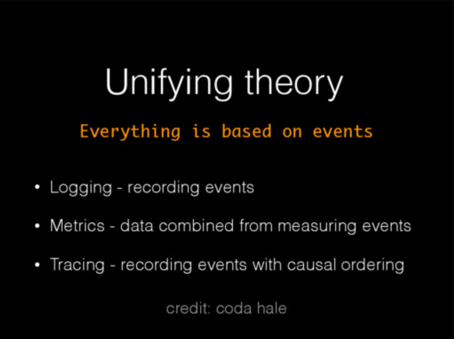
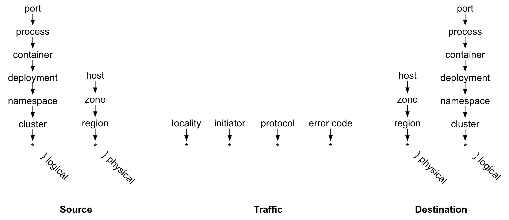

# Data model

## Observability: data model

**Three types: Tracing, Metrics, Logging.** One [analysis](https://peter.bourgon.org/blog/2017/02/21/metrics-tracing-and-logging.html) divides application observability into three types:

* Logging collects raw event data. This is usually collected in a textual form.
* Metrics give aggregate counts of quantities \(number of events per second\)
* Tracing involves `spans`: operations with a duration, and their causality relationships \(i.e., which span caused which other span\).

**Unifying theory: Events.** As Zipkin developer Adrian Cole [noted](https://speakerdeck.com/adriancole/observability-3-ways-logging-metrics-and-tracing?slide=2) in a [talk](https://www.dotconferences.com/2017/04/adrian-cole-observability-3-ways-logging-metrics-tracing), all of these are derived from events:

Looking at the different observability types, logging captures raw events; Metrics capture event projections \(e.g., sum, average, p95\), and Tracing captures events and causality.

**Context.** Each event has a context in which it happened. This can be \(1\) causal context, for example the original user transaction that caused it or the RPC it is part of, or \(2\) environmental context: the software version of the process serving the request, which thread was used, the VM instance, etc.

**Tracing already includes Logging.** The OpenTracing specification allows for [Span Logs](https://github.com/opentracing/specification/blob/master/specification.md): each span can contain zero or more key-value maps \(each with a timestamp\). So tracing actually allows Logs -- they just have a `span` context. We adopt this construction: events are always related to a span. Events can start a span, end a span, or notify the span of point events.

**Metrics summarize events: time based aggregation.** By dividing time into windows \(e.g., 1-second intervals\), it is possible to aggregate events with common context into a metric such as `sum`, `average` or `p95`. For example, when capturing individual packet receptions, it is possible to aggregate the total number of received bytes per second for each application to get an `rx-bytes-per-second` metric per application.

**Metrics are also events: time-based roll-ups.** Metrics aggregated over a time interval are, in essence, an event generated at the end of each time interval that carries the information from the aggregated metric. Thus, metrics can summarize a high frequency event stream to reduce its volume to a lower frequency event stream. Applying time-based aggregation with increasing intervals, for example 1 second, 10 second, 1 minute, 5 minutes, creates _roll-ups_ with lower and lower data volumes.

**Slicing and Dicing: GROUP BY and filters.** As mentioned above, metrics have associated context. For example, when measuring communication performance, it is possible to associate the metric to the IPs, ports, and the container, process, and thread. Given this detailed context, one can aggregate metrics according to fewer attributes: for example, given processes and IP addresses, it is possible to group all records by IP address and get a per-IP address metric.

This is also true for Logging and Tracing: it is possible to have high fidelity logs, and then forget some context information for events.

**Enriching data.** One event stream can enrich another stream, providing more context for events. For example, an agent running on a host can produce information about the containers and sockets on that host \(the first event stream\). Kubernetes can produce a stream of Pod events \(the second stream\), which contain containers information: the name of the deployment, the container image and its tag, etc. Enriching the socket stream with Pod information will create a socket event stream with better context, where each socket event also has the deployment/image/tags context \(and available for slicing and dicing\).

**Matching data streams.** A special case of enrichment, is where two sides of communication are matched. In regular enrichment, there is a main stream and a metadata stream \(socket events and pod information\). With matching, there are two main streams. Each one is useful on its own, but matching the two together provides a better enriched stream, for example each socket stream knows the process/container on the host that is providing the stream, but not on the other end. Together, process/container information from both ends is available.

## Available data

Flowmill gets data on:

* Containers, from the cgroup subsystem
* Processes and threads, with container and parent process context
* TCP sockets and socket activity \(throughput, rtt, drops\), with process context
* UDP sockets and socket activity \(throughput, packets\), with process context
* NAT records with socket context.
* Kubernetes Pods and ReplicaSets
* Docker information on containers
* AWS metadata, e.g.,`describe-network-interfaces`

## Query functionality

**Filters and aggregations.** Users should be able to query the communication in the system using filters and group bys from:

**Macro to micro scope.** Queries can span one minute or one month.

**Distribution queries.** Users should be able to query the p95, p99, p99.9 of communications, and examine distributions.

**Raw data export.** Users should be able to export raw enriched data to other systems, e.g., for intrusion detection.

**Examples and outliers \(future\).** Users should be able to get an example of a raw measurement \(e.g., a specific socket between two services\) and specifically of outliers \(which socket had high round-trip time\).

**Historical analysis \(future\).** Compare the time-series returned from a query to historical their values 1 hour, 1 week, 1 year ago, etc.

**Comparative analysis \(future\).** For all time series returned from a query, compute a metric of their relative behavior, for example load skew between different replicas of the same service.

